# RL-FEC: избыточное кодирование при помощи RL

Данный репозиторий описывает архитектуру программного обеспечения RL-FEC. Репозиторий был создан для представления решения на конкурс Junior ML Contest для поступления в магистратуру AI Talent Hub.

Программное обеспечение RL-FEC разрабатывалось в рамках стажировки в компании Huawei, а также было представлено в качестве дипломной работы на факультете "Прикладная математика и информатика" в НИУ ВШЭ (г. Санкт-Петербург).

Весь код RL-FEC находится под NDA, поэтому в репозитории представлено архитектурное описание разработанной системы.

С текстом дипломной работы, презентацией для защиты, отзывами от научного руководителя и рецензента можно ознакомиться в папке [diploma](https://github.com/alexbuyan/rl-fec/tree/main/diploma).

В папке [jmlc](https://github.com/alexbuyan/rl-fec/tree/main/jmlc) дополнительно находятся:
- Отзыв тимлида
- Презентация для конкурса
- Мотивационное письмо
- CV

Ниже будут рассмотрены основные архитектурные решения, которые были использованы при разработке RL-FEC. 

### Оглавление
- [Аннотация](https://github.com/alexbuyan/rl-fec?tab=readme-ov-file#%D0%B0%D0%BD%D0%BD%D0%BE%D1%82%D0%B0%D1%86%D0%B8%D1%8F)
- [Актуальность работы](https://github.com/alexbuyan/rl-fec?tab=readme-ov-file#%D0%B0%D0%BA%D1%82%D1%83%D0%B0%D0%BB%D1%8C%D0%BD%D0%BE%D1%81%D1%82%D1%8C-%D1%80%D0%B0%D0%B1%D0%BE%D1%82%D1%8B)
- [RL-FEC: принцип работы и архитектура](https://github.com/alexbuyan/rl-fec?tab=readme-ov-file#rl-fec-%D0%BF%D1%80%D0%B8%D0%BD%D1%86%D0%B8%D0%BF-%D1%80%D0%B0%D0%B1%D0%BE%D1%82%D1%8B-%D0%B8-%D0%B0%D1%80%D1%85%D0%B8%D1%82%D0%B5%D0%BA%D1%82%D1%83%D1%80%D0%B0)
    - [Принцип работы](https://github.com/alexbuyan/rl-fec?tab=readme-ov-file#%D0%BF%D1%80%D0%B8%D0%BD%D1%86%D0%B8%D0%BF-%D1%80%D0%B0%D0%B1%D0%BE%D1%82%D1%8B)
    - [Общая архитектура](https://github.com/alexbuyan/rl-fec?tab=readme-ov-file#%D0%BE%D0%B1%D1%89%D0%B0%D1%8F-%D0%B0%D1%80%D1%85%D0%B8%D1%82%D0%B5%D0%BA%D1%82%D1%83%D1%80%D0%B0)
    - [Эмбеддинги](https://github.com/alexbuyan/rl-fec?tab=readme-ov-file#%D1%8D%D0%BC%D0%B1%D0%B5%D0%B4%D0%B4%D0%B8%D0%BD%D0%B3%D0%B8)
    - [RL-агент](https://github.com/alexbuyan/rl-fec?tab=readme-ov-file#rl-%D0%B0%D0%B3%D0%B5%D0%BD%D1%82)
    - [Награда агента](https://github.com/alexbuyan/rl-fec?tab=readme-ov-file#%D0%BD%D0%B0%D0%B3%D1%80%D0%B0%D0%B4%D0%B0-%D0%B0%D0%B3%D0%B5%D0%BD%D1%82%D0%B0)
    - [Используемый стек](https://github.com/alexbuyan/rl-fec?tab=readme-ov-file#%D0%B8%D1%81%D0%BF%D0%BE%D0%BB%D1%8C%D0%B7%D1%83%D0%B5%D0%BC%D1%8B%D0%B9-%D1%81%D1%82%D0%B5%D0%BA)
- [Тестирование RL-FEC](https://github.com/alexbuyan/rl-fec?tab=readme-ov-file#%D1%82%D0%B5%D1%81%D1%82%D0%B8%D1%80%D0%BE%D0%B2%D0%B0%D0%BD%D0%B8%D0%B5-rl-fec)
    - [Модели потерь](https://github.com/alexbuyan/rl-fec?tab=readme-ov-file#%D0%BC%D0%BE%D0%B4%D0%B5%D0%BB%D0%B8-%D0%BF%D0%BE%D1%82%D0%B5%D1%80%D1%8C)
    - [Метрика для оптимизации](https://github.com/alexbuyan/rl-fec?tab=readme-ov-file#%D0%BC%D0%B5%D1%82%D1%80%D0%B8%D0%BA%D0%B0-%D0%B4%D0%BB%D1%8F-%D0%BE%D0%BF%D1%82%D0%B8%D0%BC%D0%B8%D0%B7%D0%B0%D1%86%D0%B8%D0%B8)
    - [Эффективный алгоритм рассчета метрики](https://github.com/alexbuyan/rl-fec?tab=readme-ov-file#%D1%8D%D1%84%D1%84%D0%B5%D0%BA%D1%82%D0%B8%D0%B2%D0%BD%D1%8B%D0%B9-%D0%B0%D0%BB%D0%B3%D0%BE%D1%80%D0%B8%D1%82%D0%BC-%D1%80%D0%B0%D1%81%D1%81%D1%87%D0%B5%D1%82%D0%B0-%D0%BC%D0%B5%D1%82%D1%80%D0%B8%D0%BA%D0%B8)
    - [Другие методы кодирования, с которыми проводилось сравнение](https://github.com/alexbuyan/rl-fec?tab=readme-ov-file#%D0%B4%D1%80%D1%83%D0%B3%D0%B8%D0%B5-%D0%BC%D0%B5%D1%82%D0%BE%D0%B4%D1%8B-%D0%BA%D0%BE%D0%B4%D0%B8%D1%80%D0%BE%D0%B2%D0%B0%D0%BD%D0%B8%D1%8F-%D1%81-%D0%BA%D0%BE%D1%82%D0%BE%D1%80%D1%8B%D0%BC%D0%B8-%D0%BF%D1%80%D0%BE%D0%B2%D0%BE%D0%B4%D0%B8%D0%BB%D0%BE%D1%81%D1%8C-%D1%81%D1%80%D0%B0%D0%B2%D0%BD%D0%B5%D0%BD%D0%B8%D0%B5)
    - [Процесс обучения](https://github.com/alexbuyan/rl-fec?tab=readme-ov-file#%D0%BF%D1%80%D0%BE%D1%86%D0%B5%D1%81%D1%81-%D0%BE%D0%B1%D1%83%D1%87%D0%B5%D0%BD%D0%B8%D1%8F)
    - [Результаты](https://github.com/alexbuyan/rl-fec?tab=readme-ov-file#%D1%80%D0%B5%D0%B7%D1%83%D0%BB%D1%8C%D1%82%D0%B0%D1%82%D1%8B)
- [Заключение](https://github.com/alexbuyan/rl-fec?tab=readme-ov-file#%D0%B7%D0%B0%D0%BA%D0%BB%D1%8E%D1%87%D0%B5%D0%BD%D0%B8%D0%B5)

### Аннотация
Данная работа посвящена разработке программной системы для решения ряда задач дискретной оптимизации порождающей матрицы двоичного линейного блокового кода и оценки его эффективности. Входными данными для программы оптимизации являются размерность порождающей матрицы, тип и параметры канала, функции оценки порождающей матрицы. Выходом является порождающая матрица заданной размерности, которая минимизирует заданный функционал.

Для решения задачи оптимизации было использовано обучение с подкреплением (reinforcement learning, RL). В качестве критерия эффективности кодов рассматривалась оценка вероятности успешной передачи сообщения (success rate, SR) через заданный канал связи с потерями. Разработанная программная система RL-FEC позволяет моделировать различные условия потерь данных, рассчитывать оценку эффективности кода и получать двоичные линейные блоковые коды с высоким показателем SR.

В рамках ряда проведенных экспериментов с различными параметрами и каналами передачи данных с потерями были получены двоичные линейные блоковые коды, которые сравнимы по показателю SR с лучшими представителями других методов кодирования.

<i>Ключевые слова:</i> упреждающая коррекция ошибок (FEC), обучение с подкреплением (RL), линейный блоковый код, порождающая матрица, канал передачи с потерями. 

### Актуальность работы
Линейные блоковые коды используются для защиты данных в процессе передачи по каналу, в котором возникают потери. Общая идея заключается в том, чтобы к сообщению длины $n$ добавить $m$ дополнительных символов, которые помогли бы восстановить исходные данные в случае потерь. Известно, что если в процессе передачи было потеряно более $m$ символов, то восстановить изначальное сообщение невозможно. Если же было потеряно не более чем $m$ символов, то существует несколько линейных блоковых кодов, позволяющих решить данную задачу.

К примеру, коды с максимальным достижимым расстоянием (Maximum Distance Separable, MDS) позволяют восстановить сообщение, если получены любые $n$ символов закодированного сообщения. Пожалуй, самыми известными кодами, обладающими данным свойством, являются **коды Рида-Соломона**. Несмотря на оптимальность с точки зрения количества восстановимых паттернов потерь в закодированном сообщении, на практике реализация процессов кодирования и декодирования связаны с большим количеством операций умножения в конечных полях порядка $2^q$. В силу того, что подавляющее большинство цифровых устройств не имеют поддержки упомянутых операций на уровне инструкций процессора, данные вычисления могут существенно влиять на быстродействие и энергоэффективность практических реализаций алгоритмов кодирования, что в частности, существенно ограничивает их применение для защиты данных в сетевых протоколах транспортного уровня на мобильных устройствах (например, видеоконференцсвязь).

В связи с этим, многие исследователи обратили свое внимание на вопрос построения линейных блоковых кодов над полем $\mathbb{F}_2$ по следующим причинам:
- реализации алгоритмов кодирования и декодирования не требуют операций умножения в конечных полях,
- возможно добиться низкой вычислительной сложности декодирования за счет использования субоптимальных декодеров,
- данные алгоритмы хорошо масштабируются до задач, в которых каждый символ закодированного сообщения представляет собой вектор из $\mathbb{F}_{2^р}$ (пакет данных).
Примерами являются различные фонтанные коды, **Low Density Parity-Check (LDPC) коды** (коды c малой плотностью проверок на чётность), **FlexFEC**, и др. Несмотря на то, что двоичные линейные коды не являются кодами с максимальным достижимым расстоянием, для многих из них показано, что они асимптотически стремятся к оптимуму с ростом длины кода.

На практике часто возникает задача поиска наилучшей по некоторой метрике $f$ порождающей матрицы линейного кода заданной размерности, когда имеется фиксированный декодер, а модель потерь и ее параметры известны приблизительно (в том числе в виде эмпирической оценки вероятности паттернов ошибок, возникающих в действительности). Такая постановка задачи выходит за рамки классических задач теории помехоустойчивого кодирования, и может быть сформулирована как следующая задача дискретной оптимизации:
$$
G^* = \arg\min\limits_{G} f(G),\  G \in \mathbb{F}_2^{n\times(n+m)}.
$$

В последнее время появились работы$^{1,2}$, в которых демонстрируется успешное применение обучения с подкреплением для задач дискретной оптимизации. Преимущество данного подхода состоит в том, что он позволяет оставлять архитектуру алгоритма неизменной, при этом настраивать входные параметры под каждую конкретную задачу, что существенно экономит время на поиск оптимальных порождающих матриц для исследователя.

1. [Goal-directed graph construction using reinforcement learning](https://arxiv.org/abs/2001.11279)
2. [Discovering faster matrix multiplication algorithms with reinforcement learning](https://www.nature.com/articles/s41586-022-05172-4)

## RL-FEC: принцип работы и архитектура
### Принцип работы
Общий принцип работы RL-FEC описывается следующей диаграммой:

Задача RL-FEC &mdash; найти порождающую матрицу $G_{opt}$, которая является оптимальной относительно заданной функции $f(G; M)$. Далее эта порождающая матрица используется для кодирования и декодирования. Всего таких матриц необходимо найти несколько, под различные условия и ограничения.

Преимущество состоит в том, что инженеру не нужно разбираться в сложной математике, стоящей за другими алгоритмами кодирования. Он может описать канал с потерями и запустить RL-FEC, через некоторое время получив набор оптимальных матриц под свои задачи. 

### Общая архитектура
Так как спектр решаемых задач может быть достаточно обширным и во многом зависит от заданных условий и ограничений, было принято решение сделать архитектуру RL-FEC максимально модульной, чтобы каждый модуль можно было переопределять под специфику задачи. В итоге была получена следующая архитектура:

В основе архитектуры лежит стандартный цикл обучения с подкреплением: агент совершает действие $a$ и получает от среды награду $r$. 

В данной задаче состояние, которое модифицируется &mdash; порождающая матрица линейного кода. В текущей реализации матрица модифицируется по столбцам, одно действие агента &mdash; целиком заполнить один столбец матрицы. 

**Класс StateModifier**

Отвечает за преобразование текущего состояния по полученному действию $a$. Помимо этого он также отвечает за создание эмбеддингов на основе порождающих матриц. Данные эмбеддинги затем используются для обучения агента.

Данный класс также сигнализирует, если состояние является терминальным, чтобы агент завершал текущую сессию взаимодействия.

**Класс RewardCalculator**

Отвечает за выдачу награды по результатам совершения действия $a$. На вход принимает предыдущее состояние порождающей матрицы $G_{old}$ и новое состояние $G_{new}$, на их основе принимает решение о том, какую награду получит агент.

Данный класс также можно настривать под необходимые задачи, путем переопределения метода для рассчета функции $f(G; M)$.

**Класс ReplayBuffer**

Сохраняет наблюдения, собранные агентом, и используется для дальнейшего обучения. Данный класс также можно переопределить, чтобы можно было использовать дополнительные техники, которые часто применяются в RL (например, <i>prioritized experience replay</i>).

### Эмбеддинги
Работать с самими порождающими матрицами для обучения RL-агента не удобно, поэтому было принято решение использовать различные эмбеддинги. 

**Метод GenMatrixToActionSet**

Принцип работы данного эмбеддинга подробно описан в разделе 4.1.1 дипломной работы. Суть состоит в следующем &mdash; порождающая матрица преобразуется в набор уникальных действих, совершенных агентом при модификации столбцов матрицы. С таким эмбеддингом оказалось достаточно легко работать, однако стоит учитывать то, что он является дискретным, поэтому с ним можно использовать только дискретные алгоритмы.

**Метод structure2vec**

Реализация данного метода сейчас находится на стадии активного исследования и разработки. Он был описан в статье [Discriminative Embeddings of Latent Variable Models for Structured Data](https://arc.net/l/quote/uxlfyvqx) и также протестирован другими исследователями для решения задачи построения графов при помощи RL, где показал хороший результат.

Идея исследовать данный подход возникла, потому что порождающие матрицы также можно представлять при помощи графов (о том, как это делать, рассказано в разделе 3.2 дипломной работы).

### RL-агент

В качестве RL-агента для baseline конфигурации используется DoubleDQN (так как используются дискретные эмбеддинги GenMatrixToActionSet).

Однако RL-FEC позволяет использовать любой RL-алгоритм, достаточно просто переопределить базовый класс со всеми необходимыми методами.

В процессе исследования и работы над проектом также использовались алгоритмы SAC и PPO, однако реализовать полностью потенциал этих алгоритмов получится, если использовать непрерывные наблюдения (эмбеддинги). Сейчас ведется активная разработка над реализацией данной функциональности

### Награда агента

Основная награда агента &mdash; функция $f(G; M)$. Однако в процессе обучения было замечено, что очень много наблюдений описывают <i>повторяющиеся действия</i> &mdash; когда агент совершил действие, а структура порождающей матрицы не изменилась. Поэтому было принято решение ввести в таких случаях штраф: $-1$ за каждое такое действие в сессии агента.

Рекомендуется определять функций $f(G; M)$, чтобы все ее значения попадали в отрезок $[0; 1]$. Так, вместе со штрафами, финальное значение награды по результатам сессии будет тоже лежать в этом отрезке и графики, полученные в процессе обучения, будет легче интерпретировать.

### Используемый стек

Программное обеспечение было реализовано на языке Python3. Код RL-FEC содержит самописные модули и алгоритмы, однако также позволяет использовать алгоритмы, реализованные в других RL-фреймворках.

Для реализации были использованы известные ML библиотеки: pytorch, gymnasium, stablebaselines3, tensorflow, matplotlib и др.

## Тестирование RL-FEC

Для доказательства универсальности разработанного программного обеспечения RL-FEC необходимо было провести тестирование и затем сравнить результаты с другими методами кодирования.

Для тестирования было необходимо сделать следующее:
- выбрать модели потерь, на которых будем тестировать RL-FEC
- выбрать функцию $f(G; M)$, относительно которой мы будем искать оптимальные коды
- провести большое количество экспериментов
- сравнить полученные при помощи RL-FEC линейные коды с другими методами кодирования

### Модели потерь

**BEC**

Binary Erasure Channel (BEC) &mdash; достаточно известный канал потерь в теории информации. Каждый пакет информации, который передается по сети, теряется независимо с какой-то вероятностью $p$.

**Модель Гильберта**

Еще одна из достаточно известных моделей, описывается следующей цепью Маркова:

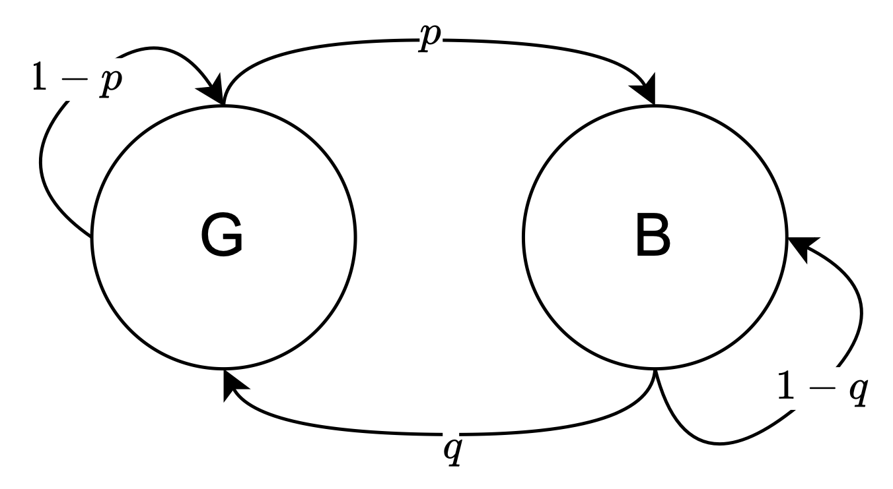

- Good (G) &mdash; хорошее состояние канала, в котором пакет считается доставленным
- Bad (B) &mdash; плохое состояние, в котором пакет считается потерянным

Переходы между состояниями задаются вероятностями $p$ и $q$

### Метрика для оптимизации

В качестве функции $f(G; M)$ была выбрана метрика **success rate (SR)** &mdash; оценка вероятности успешной передачи сообщения через канал с потерями.

Один эксперимент по передаче сообщения был устроен следующим образом:
- Один раз кодируем сообщение при помощи порождающей матрицы $G$
- Передаем сообщение по каналу, с заданной моделью потерь $M$
- Генерируется маска потерь, мы применяем ее к закодированному сообщению и часть информации теряется
- Из оставшейся информации пытаемся восстановить исходное сообщение
- Если все получилось - эксперимент считается успешным.

Данный эксперимент мы повторяем большое количество раз. Метрика SR считается так:
$$
SR = \frac{K}{N},
$$
где $K$ - количество успешных экспериментов, $N$ - количество всех проведенных экспериментов.

### Эффективный алгоритм рассчета метрики

Есть несколько проблем при подсчете данной метрики. Основная состоит в том, что для достижения необходимой точности нужно провести больше количество экспериментов (примерно $N=10^8$). Для этого нужно под каждую модель потерь $M$ сгенерировать такое количество масок и сохранить это в памяти. Другая проблема в том, что длина маски должна совпадать с количеством столбцов порождающей матрицы, поэтому для каждого эксперимента приходится использовать отдельный датасет.

Эту проблему удалось решить следующим образом:
- Все данные представлять при помощи `int64`, тогда при наложении масок все работает корректно из-за выравнивания
- Сгенерировать один большой набор масок длины `64`, с которым будут взаимодействовать все эксперименты

После этого был придуман алгоритм рассчета SR, который можно было векторизовать и выполнять на GPU. Данный алгоритм использует свойство о покрывающих множествах, которое было описано в статье [Erasure Correction Performance of Linear Block Codes](https://www.researchgate.net/publication/221508312_Erasure_Correction_Performance_of_Linear_Block_Codes).

В результате данный алгоритм был оформлен при помощи библиотеки FastAPI в отдельный API-сервер, который обрабатывает запросы от всех агентов. Данный сервер использует мощность GPU и обрабатывает запросы в многопоточном режиме. Он позволяет инициализировать его при помощи модели потерь $M$ и затем использовать для обучения необходимых агентов. 

Такой подход позволил значительно ускорить обучение и теперь необходимое количество эксперименто $N=10^8$ проверяется примерно за 1 секунду.

### Другие методы кодирования, с которыми проводилось сравнение

Сравнение по метрике SR проводилось с 3 другими методами. 

Первый из них &mdash; [коды Рида-Соломона](https://ru.wikipedia.org/wiki/%D0%9A%D0%BE%D0%B4_%D0%A0%D0%B8%D0%B4%D0%B0_%E2%80%94_%D0%A1%D0%BE%D0%BB%D0%BE%D0%BC%D0%BE%D0%BD%D0%B0). Эти коды относятся к классу нетривиальных MDS-кодов и с точки зрения метрики SR являются самыми эффективными. Однако они используют операции в поле GF(256), что сильно увеличивает сложность кодирования и декодирования и делает его менее энергоэффективным.

Более энергоэффективные методы используют операции в GF(2), среди них мы выделили 2:
- [LDPC-коды](https://ru.wikipedia.org/wiki/%D0%9A%D0%BE%D0%B4_%D1%81_%D0%BC%D0%B0%D0%BB%D0%BE%D0%B9_%D0%BF%D0%BB%D0%BE%D1%82%D0%BD%D0%BE%D1%81%D1%82%D1%8C%D1%8E_%D0%BF%D1%80%D0%BE%D0%B2%D0%B5%D1%80%D0%BE%D0%BA_%D0%BD%D0%B0_%D1%87%D1%91%D1%82%D0%BD%D0%BE%D1%81%D1%82%D1%8C)
- [FlexFEC](https://datatracker.ietf.org/doc/html/draft-ietf-payload-flexible-fec-scheme#section-1.1.7)

При сравнении с этими тремя методами по метрике SR были поставлены следующие задачи:
- При помощи RL-FEC генерируем коды, использующие операции в поле GF(2)
- При помощи RL-FEC найти коды, такие что:
    - Приближены к кодам Рида-Соломона по метрике SR
    - Превосходят LDPC-коды и FlexFEC по метрике SR

При этом эти условия должны выполняться на обеих моделях потерь, для которых мы проводим тестирование &mdash; тем самым будет доказана универсальность RL-FEC (может подстраиваться под разные модели потерь)

### Процесс обучения

Чтобы показать стабильность обучения агента при заданной архитектуре RL-FEC, один эксперимент был запущен несколько раз. Параметры эксперимента были следующими:
- количество изначальных пакетов $n=5$
- количество избыточных пакетов $m=14$
- модель потерь $BEC(p=0.4)$

В результате были построены графики основных метрик во время обучения (с доверительными интервалами $\alpha=0.05$)

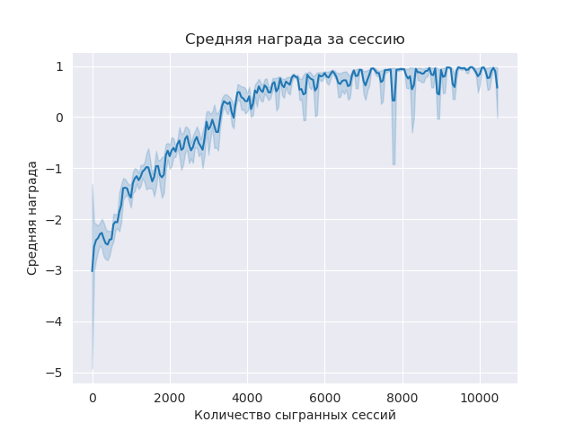
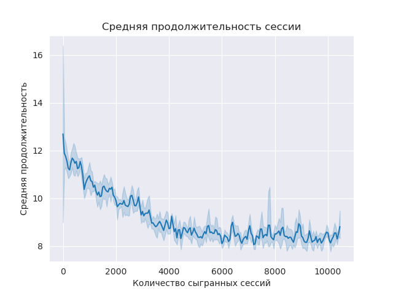
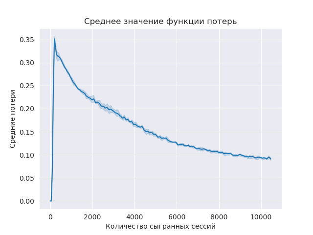

Из графика можно увидеть, что уже спустя 6000 сессий средняя награда попадает в отрезок $[0; 1]$, что и ожидается при текущей архитектуре RL-FEC

### Результаты

В этой главе будут рассмотрены графики сравнения по метрике SR всех 4 методов кодирования.

**BEC**

На модели BEC получилось добиться следующих результатов:
- На всех экспериментах есть превышение (или одинаковые значения) в сравнении с FlexFEC
- Есть эксперименты, где LDPC-коды показали чуть более эффективные результаты
- Разница с RS менее 1%

Отсюда были сделаны следующий вывод &mdash; на больших $n$ и $m$ агент имеет тенденцию недообучаться, поэтому возникает потребность дальнейшего исследования других эмбеддингов порождающей матрицы.

Однако все равно на большом количестве экспериментов RL-FEC работает стабильно и не требует дополнительных настроек, в отличие от других методов.

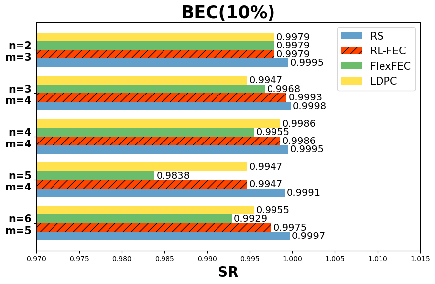
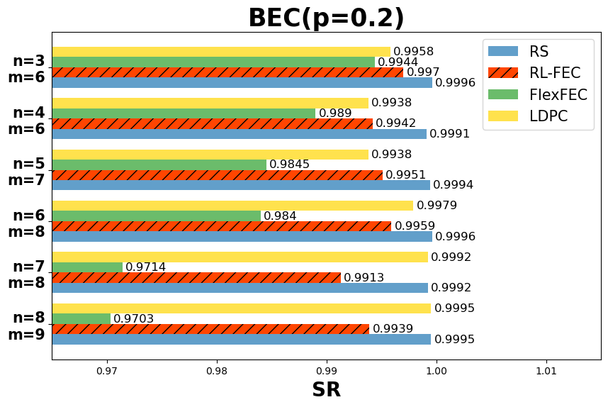
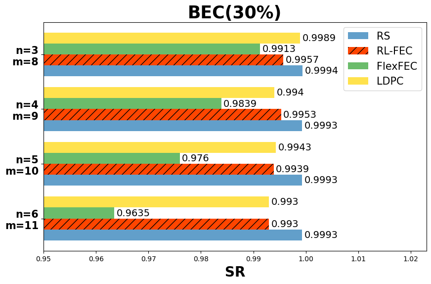
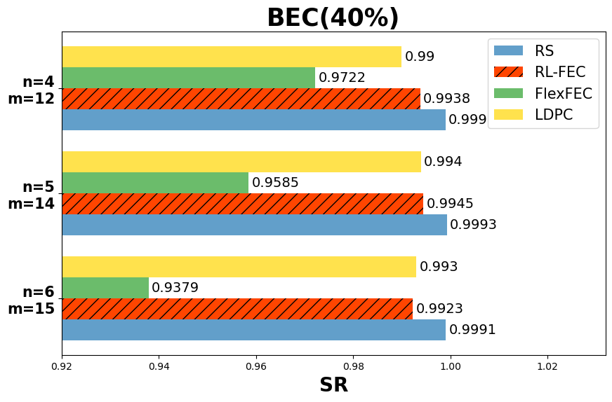
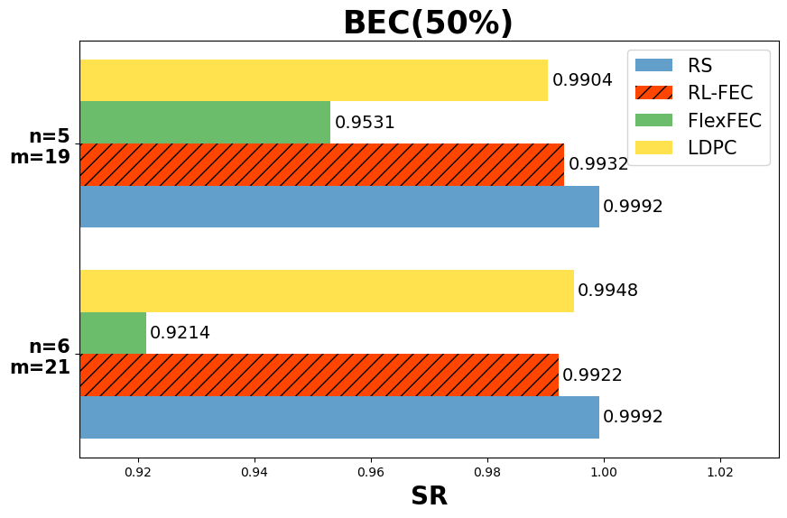

**модель Гильберта**

На модели Гильберта получены следующие результаты:
- На всех экспериментах есть превышение (или одинаковые значения) в сравнении с FlexFEC и LDPC-кодами
- Разница с RS менее 1%

Данный результаты доказывают универсальность RL-FEC &mdash; подход в процессе обучения смог подстроиться под исследуемую модель потерь. Другие методы не обладают данным преимуществом, поэтому приходиться разбираться в дополнительных настройках методов, чтобы улучшить результат. В случае же с RL-FEC достаточно просто запустить обучение агента. 

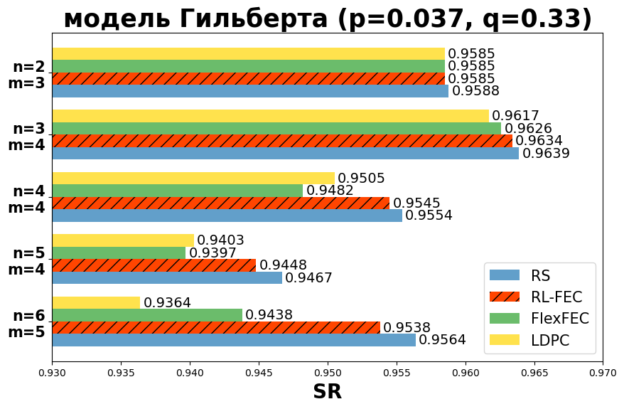
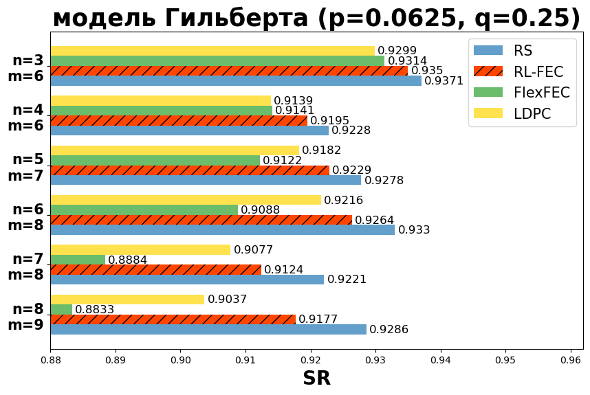
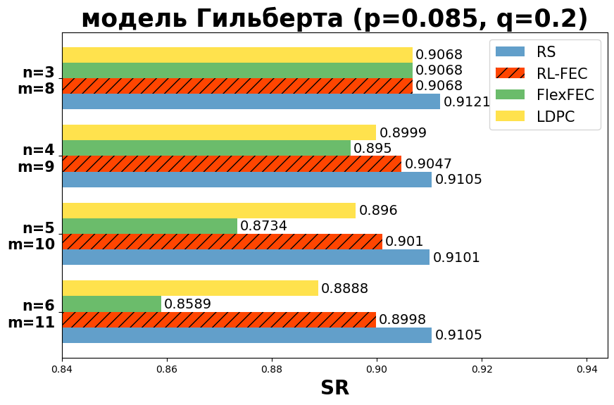

## Заключение
В рамках дипломной работы было разработана программное обеспечение RL-FEC, позволяющее получать методы избыточного кодирования при помощи RL. Архитектура решения получилась универсальной и модульной, что позволяет быстро настраивать RL-FEC под конкретную задачу. 

Также подход был протестирован на различных моделях потерь, где еще раз показал свою универсальность относительно других методов.
